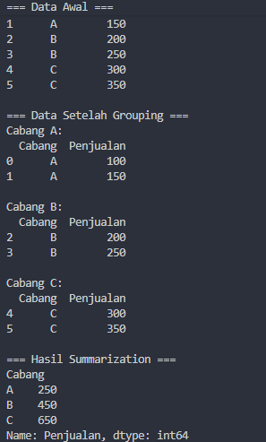
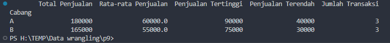
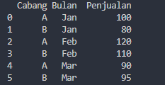
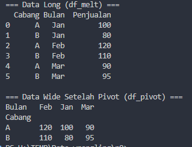
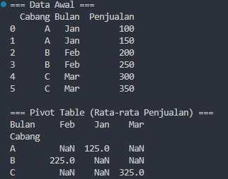
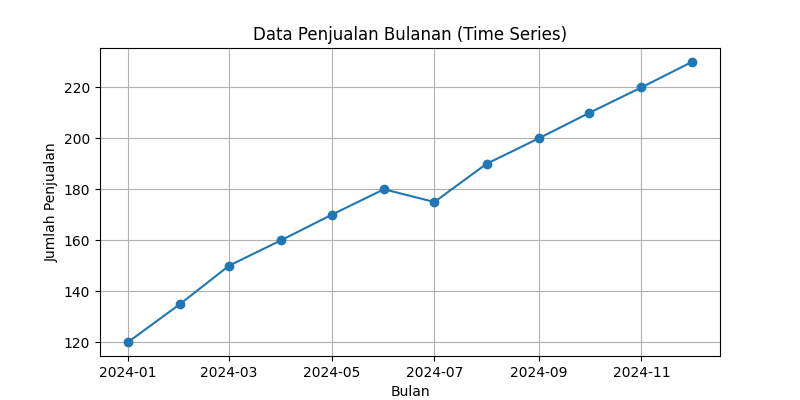
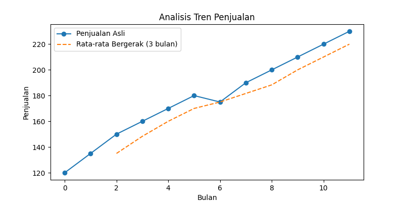

<div align="center">
  # Analisis & Visualisasi Data Penjualan dengan Python
</div>
<div align="center">

  <h3><i>Transform Data, Unlock Insights, Drive Innovation</i></h3>

  
  
  

  <br><br>

  <h3><i>Built with the tools and technologies:</i></h3>

  

</div>

---

Repository ini berisi kumpulan skrip Python sederhana untuk belajar **analisis data penjualan** menggunakan:

- `pandas` untuk manipulasi dan transformasi data  
- `groupby` dan operasi **agregasi**  
- **reshaping** data (wide ↔ long) dengan `melt`, `pivot`, dan `pivot_table`  
- **transformasi struktural** kolom (split teks, ubah format tanggal)  
- **time series**: visualisasi dasar & analisis tren dengan **moving average**  
- **prediksi tren** penjualan menggunakan **Linear Regression** dari `scikit-learn`

Semua contoh menggunakan data yang dibuat langsung di dalam kode (tidak membutuhkan file CSV eksternal), sehingga mudah dipelajari dan dijalankan di mana saja.


---

## Prasyarat & Instalasi

### Versi Python

Disarankan menggunakan:

- **Python 3.9+** 

### Library yang Digunakan

Beberapa skrip hanya membutuhkan `pandas`, yang lain juga memerlukan `matplotlib` dan `scikit-learn`.

```bash
pip install pandas matplotlib scikit-learn numpy
```

---

## Cara Menjalankan

1. Clone atau download repository ini.
2. Masuk ke folder repo:

   ```bash
   cd nama-folder-repo
   ```

3. Jalankan skrip yang diinginkan, contoh:

   ```bash
   python "Grouping _dan_Summarization.py"
   python Operasi_Agregasi.py
   python "Reshaping_Data_Fungsi_Melt().py"
   python "Reshaping_Data_Fungsi_Pivot().py"
   python Reshaping_Data_Fungsi_Pivot_Table.py
   python Transformasi_Struktural.py
   python Time_Series_Visualisasi_Dasar.py
   python "Time _Series_Analisis_Tren_(Moving_Average).py"
   python Prediksi_dengan_Linear_Regression.py
   ```

---

##  Penjelasan Setiap Skrip

### `Grouping _dan_Summarization.py`

**Tujuan:**  
Memperkenalkan konsep **grouping** dan **summarization** dengan `pandas`.

**Isi utama skrip:**

- Membuat `DataFrame` sederhana berisi dua kolom:
  - `Cabang`: label cabang (A, B, C)
  - `Penjualan`: angka penjualan masing-masing baris
- Menampilkan **data awal**.
- Mengelompokkan data berdasarkan `Cabang` dengan:

  ```python
  grup = df.groupby('Cabang')
  ```

- Menampilkan isi tiap grup:

  ```python
  for nama, isi in grup:
      print(f"Cabang {nama}:")
      print(isi)
  ```

- Menghitung **total penjualan per cabang** dengan:

  ```python
  hasil = grup['Penjualan'].sum()
  ```
<p align="center">
   
</p>

**Konsep yang dipelajari:**

- `groupby` dasar
- Iterasi hasil `groupby`
- Fungsi agregasi sederhana (`sum`)

---

### `Operasi_Agregasi.py`

**Tujuan:**  
Memperlihatkan cara melakukan **beberapa operasi agregasi sekaligus** pada data penjualan.

**Isi utama skrip:**

- Data berisi:
  - `Tanggal`: tanggal transaksi
  - `Cabang`: A atau B
  - `Produk`: nama produk (Sabun, Sampo, Pasta Gigi)
  - `Penjualan`: nilai penjualan dalam satuan rupiah
- Data dimasukkan ke `DataFrame`:

  ```python
  df = pd.DataFrame(data)
  ```

- Agregasi per `Cabang` menggunakan `groupby` dan `agg`:

  ```python
  hasil_agregasi = df.groupby('Cabang').agg({
      'Penjualan': ['sum', 'mean', 'max', 'min', 'count']
  })
  ```

- Mengganti nama kolom multi-level menjadi nama yang lebih mudah dibaca, misalnya:

  ```python
  hasil_agregasi.columns = [
      'Total Penjualan',
      'Rata-rata Penjualan',
      'Penjualan Tertinggi',
      'Penjualan Terendah',
      'Jumlah Transaksi'
  ]
  ```



**Konsep yang dipelajari:**

- `groupby` dengan `agg` (multi agregasi)
- Mengelola kolom multi-index hasil agregasi

---

### `Reshaping_Data_Fungsi_Melt().py`

**Tujuan:**  
Belajar mengubah data dari format **wide** menjadi **long** menggunakan `pd.melt`.

**Isi utama skrip:**

- Data awal (wide) berisi:
  - Kolom `Cabang`
  - Kolom bulan: `Jan`, `Feb`, `Mar`
- Dibuat `DataFrame`:

  ```python
  df = pd.DataFrame(data)
  ```

- Dikonversi ke format long:

  ```python
  df_melt = pd.melt(
      df,
      id_vars=['Cabang'],
      var_name='Bulan',
      value_name='Penjualan'
  )
  ```

Hasil akhir memiliki tiga kolom: `Cabang`, `Bulan`, `Penjualan`.



**Konsep yang dipelajari:**

- Perbedaan format **wide vs long**
- Fungsi `pd.melt` dan parameter pentingnya (`id_vars`, `var_name`, `value_name`)

---

### `Reshaping_Data_Fungsi_Pivot().py`

**Tujuan:**  
Memahami proses bolak-balik antara format **wide → long → wide** dengan `melt` dan `pivot`.

**Isi utama skrip:**

1. Data awal **wide**:
   - `Cabang`, `Jan`, `Feb`, `Mar`
2. Diubah ke **long** menggunakan `pd.melt` (sama seperti skrip sebelumnya).
3. Dari data long `df_melt`, dikembalikan lagi ke wide:

   ```python
   df_pivot = df_melt.pivot(
       index='Cabang',
       columns='Bulan',
       values='Penjualan'
   )
   ```



**Konsep yang dipelajari:**

- `pd.melt` (wide → long)
- `DataFrame.pivot` (long → wide)
- Struktur indeks & kolom setelah pivot

---

### `Reshaping_Data_Fungsi_Pivot_Table.py`

**Tujuan:**  
Menunjukkan penggunaan `pivot_table` ketika ada **lebih dari satu baris** untuk kombinasi indeks-kolom yang sama.

**Isi utama skrip:**

- Data awal berisi nilai penjualan **ganda** per cabang dan bulan.
- `pivot_table` digunakan untuk menghitung **rata-rata penjualan** per cabang dan bulan:

  ```python
  pivot_tbl = df.pivot_table(
      index='Cabang',
      columns='Bulan',
      values='Penjualan',
      aggfunc='mean'
  )
  ```



**Perbedaan utama `pivot` vs `pivot_table`:**

- `pivot` mengharuskan kombinasi `(index, columns)` **unik**, kalau tidak akan error.
- `pivot_table` bisa menangani duplikasi dengan cara menerapkan fungsi agregasi (`aggfunc`), misalnya `mean`, `sum`, dll.

---

### `Transformasi_Struktural.py`

**Tujuan:**  
Memperkenalkan **transformasi struktur kolom**, seperti memecah teks dan mengubah format tanggal.

**Isi utama skrip:**

- Data awal:

  - `ID_Pelanggan`
  - `Nama_Lengkap` (misal: `"Andi Saputra"`)
  - `Tanggal` dalam format `'YYYY/MM/DD'`

- Memecah nama lengkap menjadi dua kolom:

  ```python
  df[['Nama_Depan', 'Nama_Belakang']] = df['Nama_Lengkap'].str.split(
      ' ', n=1, expand=True
  )
  ```

- Mengubah format tanggal:

  ```python
  df['Tanggal'] = pd.to_datetime(df['Tanggal']).dt.strftime('%d-%m-%Y')
  ```


**Konsep yang dipelajari:**

- `Series.str.split` dengan `expand=True`
- Konversi string ke datetime dengan `pd.to_datetime`
- Format tanggal dengan `strftime`

---

### `Time_Series_Visualisasi_Dasar.py`

**Tujuan:**  
Memberikan contoh **visualisasi dasar** untuk data time series penjualan bulanan.

**Isi utama skrip:**

- Data awal:

  - `Bulan`: string `'YYYY-MM'` dari Januari sampai Desember
  - `Penjualan`: angka penjualan masing-masing bulan

- Dibuat `DataFrame`, lalu kolom `Bulan` dikonversi ke `datetime` dan dijadikan index:

  ```python
  df['Bulan'] = pd.to_datetime(df['Bulan'])
  df.set_index('Bulan', inplace=True)
  ```

- Visualisasi:

  ```python
  plt.figure(figsize=(8, 4))
  plt.plot(df.index, df['Penjualan'], marker='o')
  plt.title('Data Penjualan Bulanan (Time Series)')
  plt.xlabel('Bulan')
  plt.ylabel('Jumlah Penjualan')
  plt.grid(True)
  plt.show()
  ```



**Konsep yang dipelajari:**

- Time series dengan index bertipe datetime
- Plot garis sederhana untuk data penjualan bulanan

---

### `Time _Series_Analisis_Tren_(Moving_Average).py`

**Tujuan:**  
Melakukan **analisis tren** menggunakan **moving average (rata-rata bergerak)**.

**Isi utama skrip:**

- Struktur data mirip dengan skrip visualisasi dasar (penjualan bulanan).
- Dibuat kolom baru `MA_3`:

  ```python
  df['MA_3'] = df['Penjualan'].rolling(window=3).mean()
  ```

- Kemudian diplot dua garis:
  - Garis **penjualan asli**
  - Garis **moving average 3 bulan**

  Contoh:

  ```python
  plt.figure(figsize=(8, 4))
  plt.plot(df.index, df['Penjualan'], label='Penjualan Asli', marker='o')
  plt.plot(df.index, df['MA_3'], label='Rata-rata Bergerak (3 bulan)', linestyle='--')
  plt.title('Analisis Tren Penjualan')
  plt.xlabel('Bulan')
  plt.ylabel('Penjualan')
  plt.legend()
  plt.show()
  ```



**Konsep yang dipelajari:**

- Fungsi `rolling` pada `pandas`
- Moving average sebagai alat smoothing untuk melihat tren jangka pendek


```python
df['Bulan'] = pd.to_datetime(df['Bulan'])
df.set_index('Bulan', inplace=True)
```

sebelum plotting.

---

### `Prediksi_dengan_Linear_Regression.py`

**Tujuan:**  
Memprediksi **tren penjualan ke depan** dengan model **Linear Regression** sederhana.

**Isi utama skrip:**

1. Membuat data penjualan bulanan untuk 12 bulan (2024-01 s/d 2024-12).
2. Membuat `DataFrame` dari data tersebut.
3. Menambahkan kolom `time_index` sebagai representasi numerik waktu:

   ```python
   df['time_index'] = np.arange(len(df))  # 0 sampai 11
   ```

4. Menentukan fitur dan target:

   ```python
   X = df[['time_index']]   # fitur
   y = df['Penjualan']      # target
   ```

5. Membuat dan melatih model:

   ```python
   model = LinearRegression()
   model.fit(X, y)
   ```

6. Memprediksi penjualan **bulan ke-13** (index 12):

   ```python
   next_month = np.array([[12]])
   prediksi_bulan13 = model.predict(next_month)[0]
   print(f"Prediksi penjualan bulan ke-13: {prediksi_bulan13:.2f}")
   ```

7. Membuat garis tren untuk 0–12 (termasuk bulan ke-13) dan mem-plot hasilnya:

   ```python
   X_all = np.arange(0, 13).reshape(-1, 1)
   y_pred_all = model.predict(X_all)

   plt.figure(figsize=(9, 5))
   plt.plot(df['time_index'], y, label='Data Aktual', marker='o')
   plt.plot(X_all, y_pred_all, label='Tren Linear (Prediksi)', linestyle='--')
   plt.scatter(12, prediksi_bulan13, label=f'Prediksi Bulan ke-13 = {prediksi_bulan13:.2f}')
   plt.title('Prediksi Tren Penjualan dengan Linear Regression')
   plt.xlabel('Bulan ke-')
   plt.ylabel('Penjualan')
   plt.legend()
   plt.grid(True)
   plt.show()
   ```


**Konsep yang dipelajari:**

- Ide dasar regresi linear untuk data time series yang sudah diindeks waktu
- Cara menggunakan `LinearRegression` dari `scikit-learn`
- Visualisasi data aktual vs garis tren model

---

